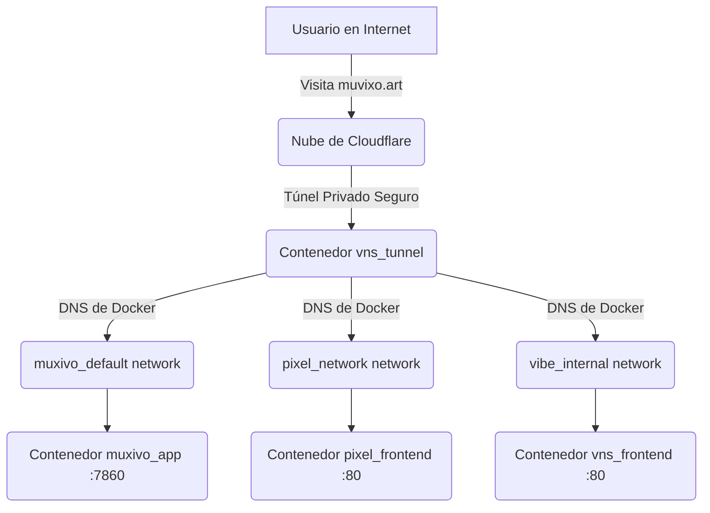

# Arquitectura de Red de tu Servidor (Cloudflare, Docker y Tailscale)

Este documento explica cómo funciona exactamente el flujo de tráfico desde que un usuario escribe tus dominios (muvixo.art, pixelnosekai.art o vibe) hasta que tu servidor responde, y por qué Tailscale no se ve afectado.

## 1. El Guardián Principal: Cloudflare Zero Trust (El Túnel)
A diferencia de los servidores web tradicionales que necesitan tener "puertas abiertas" (puertos 80 y 443) hacia internet, **tu servidor es invisible y blindado**.

Tú estás usando un **Cloudflare Tunnel**. El contenedor `vns_tunnel` que corre en tu VPS no recibe conexiones de internet; en su lugar, él crea una conexión **saliente y segura** directamente hacia los servidores de Cloudflare. 
- Cuando alguien visita `muvixo.art`, Cloudflare recibe la visita en la nube.
- Cloudflare manda esa visita a través de la tubería privada hasta tu contenedor `vns_tunnel`.

## 2. El Repartidor Interno: Docker Networks
Una vez que la visita llega al `vns_tunnel` dentro de tu servidor, el túnel tiene que saber a quién entregársela. En tu panel de Cloudflare, tú configuraste que:
- `muvixo.art` vaya hacia `http://muxivo_app:7860`
- `pixelnosekai.art` vaya hacia `http://pixel_frontend:80`

**¿Cómo encuentra el túnel a estos contenedores?**
Al principio de nuestra depuración, el túnel solo pertenecía a la red privada de Vibe (`vibe_internal`), por lo que no conocía a sus vecinos. 
La solución fue "darle un pase VIP" al túnel para que pertenezca a múltiples redes al mismo tiempo:
1. `vibe_internal` (Para ver a Vibe)
2. `muxivo_default` (Para ver a Muvixo)
3. `pixel_network` (Para ver a Pixel)

Ahora, usando el DNS mágico interno de Docker, el túnel simplemente grita el nombre del contenedor y le entrega el tráfico directo, **sin usar los puertos de tu servidor**.

## 3. ¿Qué pasa con Traefik y los puertos 80/443?
El panel de Hostinger instaló Traefik, pero gracias a tu Túnel de Cloudflare, **Traefik está siendo totalmente ignorado** para tus páginas principales. Tu túnel le habla a los contenedores directamente. 

Debido a que el tráfico viaja por el túnel, **los puertos 80 y 443 de tu servidor público ni siquiera necesitan estar abiertos**.

## 4. ¿Por qué Tailscale está a salvo?
Tailscale es una VPN privada. Funciona creando una tarjeta de red virtual dentro de tu servidor con una IP especial (ej. `fd7a:115c:...`).
- Tailscale está apoderado del puerto **443** única y exclusivamente dentro de su propia IP virtual.
- Como tus páginas web se comunican a través del **Túnel de Cloudflare** y no a través del puerto 443 tradicional, **Tailscale y tus páginas web nunca chocan**.
- ¡Tus conexiones SSH a través de Tailscale están 100% protegidas y operativas!

---

### Resumen Visual del Flujo

